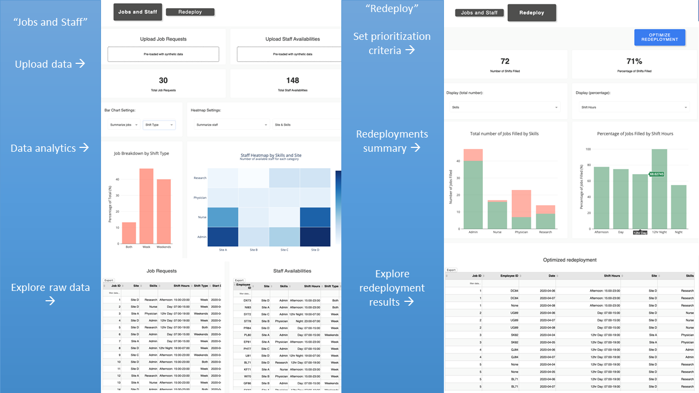

# Redeploy
Co-Founded a pro-bono consulting service to help hospitals meet changing staffing demand during the COVID-19 pandemic. Hospitals upload their newly available staff due to certain hospitals units temporarily halting operations, as well as any new jobs that need to be filled. Our tool takes in those inputs, displays analytics on the data, and then calls a mathematical optimization algorithm to make the optimal matches in a matter of seconds. The matches are then displayed for the hospitals to incorporate into their staffing decision making.

Tools used: Python, OR-Tools, Dash, AWS

The full repo is private and shared between the co-founders. I have linked the website that includes a demo of the web-app we developed that: https://redeploy.ca/demo/

We were featured on several news articles, including: https://www.utoronto.ca/news/u-t-engineering-team-develops-tool-help-hospitals-redeploy-staff-amid-covid-19-pandemic

A screenshot of what the webapp looks like is as follows:

